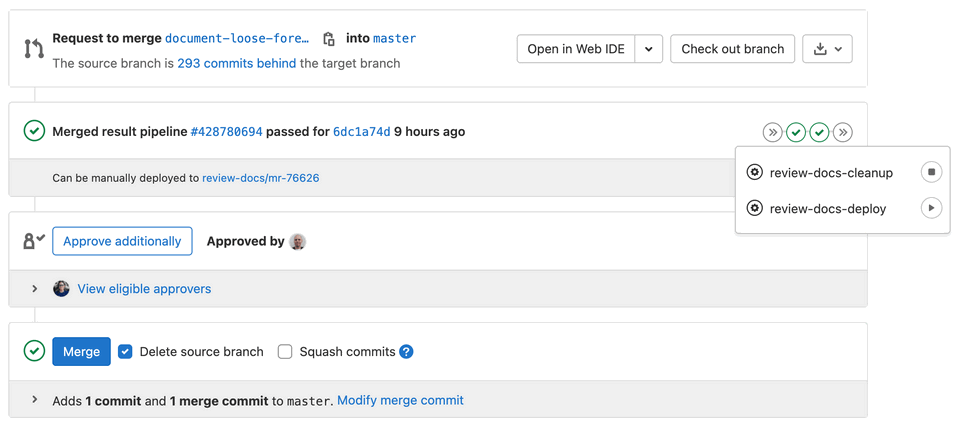

# Documentation review apps

If you're a GitLab team member and your merge request contains documentation changes, you can use a review app to preview
how they would look if they were deployed to the [GitLab Docs site](https://docs.gitlab.com).

Review apps are enabled for the following projects:

- [GitLab](https://gitlab.com/gitlab-org/gitlab)
- [Omnibus GitLab](https://gitlab.com/gitlab-org/omnibus-gitlab)
- [GitLab Runner](https://gitlab.com/gitlab-org/gitlab-runner)
- [GitLab Charts](https://gitlab.com/gitlab-org/charts/gitlab)

Alternatively, check the [`gitlab-docs` development guide](https://gitlab.com/gitlab-org/gitlab-docs/blob/main/README.md#development-when-contributing-to-gitlab-documentation)
or [the GDK documentation](https://gitlab.com/gitlab-org/gitlab-development-kit/blob/main/doc/howto/gitlab_docs.md)
to render and preview the documentation locally.

## How to trigger a review app

If a merge request has documentation changes, use the `review-docs-deploy` manual job
to deploy the documentation review app for your merge request.

The `review-docs-deploy*` job triggers a cross project pipeline and builds the
docs site with your changes. When the pipeline finishes, the review app URL
appears in the merge request widget. Use it to navigate to your changes.

You must have the Developer role in the project. Users without the Developer role, such
as external contributors, cannot run the manual job. In that case, ask someone from
the GitLab team to run the job.

## Technical aspects

If you want to know the in-depth details, here's what's really happening:

1. You manually run the `review-docs-deploy` job in a merge request.
1. The job runs the [`scripts/trigger-build.rb`](https://gitlab.com/gitlab-org/gitlab/-/blob/master/scripts/trigger-build.rb)
   script with the `docs deploy` flag, which triggers the "Triggered from `gitlab-org/gitlab` 'review-docs-deploy' job"
   pipeline trigger in the `gitlab-org/gitlab-docs` project for the `$DOCS_BRANCH` (defaults to `main`).
1. The preview URL is shown both at the job output and in the merge request
   widget. You also get the link to the remote pipeline.
1. In the `gitlab-org/gitlab-docs` project, the pipeline is created and it
   [skips the test jobs](https://gitlab.com/gitlab-org/gitlab-docs/blob/8d5d5c750c602a835614b02f9db42ead1c4b2f5e/.gitlab-ci.yml#L50-55)
   to lower the build time.
1. Once the docs site is built, the HTML files are uploaded as artifacts.
1. A specific runner tied only to the docs project, runs the Review App job
   that downloads the artifacts and uses `rsync` to transfer the files over
   to a location where NGINX serves them.

The following GitLab features are used among others:

- [Manual jobs](../../ci/jobs/job_control.md#create-a-job-that-must-be-run-manually)
- [Multi project pipelines](../../ci/pipelines/multi_project_pipelines.md)
- [Review Apps](../../ci/review_apps/index.md)
- [Artifacts](../../ci/yaml/index.md#artifacts)
- [Specific runner](../../ci/runners/runners_scope.md#prevent-a-specific-runner-from-being-enabled-for-other-projects)
- [Merge request pipelines](../../ci/pipelines/merge_request_pipelines.md)

## Troubleshooting review apps

### Review app returns a 404 error

If the review app URL returns a 404 error, either the site is not
yet deployed, or something went wrong with the remote pipeline. You can:

- Wait a few minutes and it should appear online.
- Check the manual job's log and verify the URL. If the URL is different, try the
  one from the job log.
- Check the status of the remote pipeline from the link in the merge request's job output.
  If the pipeline failed or got stuck, GitLab team members can ask for help in the `#docs`
  chat channel. Contributors can ping a technical writer in the merge request.

### Not enough disk space

Sometimes the review app server is full and there is no more disk space. Each review
app takes about 570MB of disk space.

A cron job to remove review apps older than 20 days runs hourly,
but the disk space still occasionally fills up. To manually free up more space,
a GitLab technical writing team member can:

1. Navigate to the [`gitlab-docs` schedules page](https://gitlab.com/gitlab-org/gitlab-docs/-/pipeline_schedules).
1. Select the play button for the `Remove old review apps from review app server`
   schedule. By default, this cleans up review apps older than 14 days.
1. Navigate to the [pipelines page](https://gitlab.com/gitlab-org/gitlab-docs/-/pipelines)
   and start the manual job called `clean-pages`.

If the job says no review apps were found in that period, edit the `CLEAN_REVIEW_APPS_DAYS`
variable in the schedule, and repeat the process above. Gradually decrease the variable
until the free disk space reaches an acceptable amount (for example, 3GB).
Remember to set it to 14 again when you're done.

There's an issue to [migrate from the DigitalOcean server to GCP buckets](https://gitlab.com/gitlab-org/gitlab-docs/-/issues/735)),
which should solve the disk space problem.
